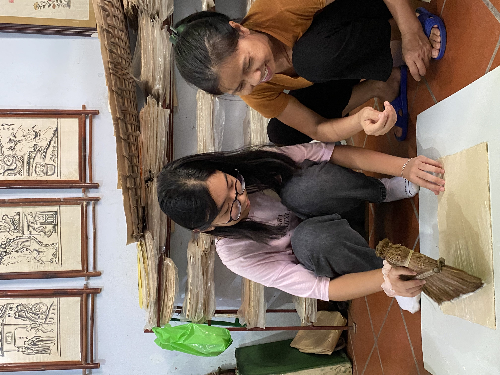
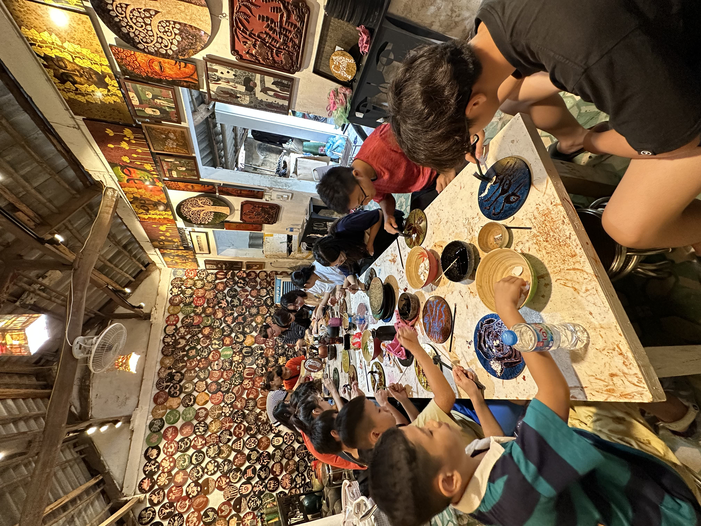

I founded Viet Art Legacy to conserve the most beautiful values of Vietnamese folk paintings and to bridge the gap between folk art and today's new population. I completed training workshops on the process and techniques of creating Đông Hồ paintings in Đông Hồ Village, Bac Ninh. Besides, I successfully marketed and sold more than 50 Đông Hồ paintings at the “Pont de Long Bien” Fair gaining 15 million VND and online-sold self-designed patterns of Đông Hồ and Truc Chi paintings to promote the distinctive features of traditional Vietnamese art, generating 22 million VND in revenue

1. VietArt - Bac Ninh

I had the opportunity to participate in a special experience in the Dong Ho painting village in Bac Ninh, under the guidance of the artist Nguyen Huu Qua - one of the key figures in preserving and developing the Dong Ho folk art. He shared his knowledge with us, from preparing natural colors to making paper from rice leaves, to using brushes and strokes to create unique Dong Ho paintings. I could feel the dedication and passion of the artist in preserving traditional art. He has passed down his knowledge and techniques to future generations, helping them continue the tradition and advance the art of Dong Ho painting. The lesson helped me understand the deeper cultural value of Dong Ho paintings. Each Dong Ho painting carries a message about life, the human spirit, and Vietnamese traditions. From the vibrant colors to the arrangement of images and stories told through each small detail, Dong Ho paintings are a depiction of life, love for the homeland, and national pride. In my journey to promote traditional Vietnamese folk art, I realized that I have an important responsibility. It is the responsibility to maintain and develop Dong Ho painting while sharing its cultural value with the world. Dong Ho painting is not only an artistic symbol of Vietnam but also a bridge to a better understanding of the history, culture, and soul of the Vietnamese people.

2. VietArt - Ponde

At first, when I decided to participate in this fair and set up a booth to sell Dong Ho paintings, I didn't just think about sharing the beauty of traditional art but also about contributing to building a better society. My goal was not just to sell paintings but to create real value for the community. Dong Ho paintings have long been known for their beauty and special historical significance. This inspired me to bring the artistic value closer to everyone.
I spent a lot of time preparing for my booth; it was an opportunity to showcase my artistic skills and my passion for the homeland's art in creating a traditional yet captivating space. I also had the chance to share knowledge about the history and significance of each artwork with foreign visitors. Each painting tells a story and reflects a part of Vietnamese culture and history.
Thanks to the support of everyone, the Dong Ho painting booth has generated nearly 15 million VND in profit, with over 50 paintings sold.

3. VietArt - Son Mai

The Hạ Thái lacquerware village is located in a peaceful countryside, about 30 kilometers from Hanoi. This place is famous for its traditional lacquerware painting craft. During the visit, I was guided by some talented lacquerware artists. They shared the process of producing lacquer paintings, from crafting wooden frames, mixing colors from natural ingredients like resin from cajeput trees, to painting and polishing the artworks. This truly amazed me at the precision and patience of these artists. They worked meticulously and diligently to create beautiful lacquer paintings, each of which is a unique piece of art. Not only did I get to admire the exquisite lacquer paintings, but I also had the opportunity to experience the process of making them myself. We were taught how to paint and color the lacquerware, and I discovered that it requires skill and concentration from the artists. With the wholehearted support of the artisans, I created my own small pieces, which was a fun and educational experience.
