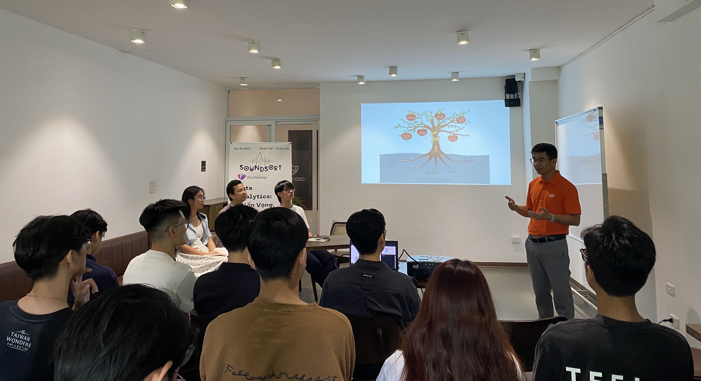

“Soundsort” is a non-profit project founded by a group of students from high schools in Hanoi city with the main goal of providing a multi-dimensional view for music content developers through collecting data from people who listen to and use popular music streaming apps today. I am responsible for developing content and overseeing 4 sub-committees, including 12 members. We analyze in detail the strengths and weaknesses of each online music streaming application. At the same time, we organized small workshops both online and offline about Data Analytic.

Recently, I had the opportunity to organize a workshop on "Data Analytics: Prospects, Trends, and Applications" as part of the "Soundsort" project. This is a non-profit project organized by a group of high school students from Hanoi, and its main goal is to provide a multidimensional perspective for music content developers by collecting data from listeners and using popular music streaming applications. The event attracted over 50 students from different high schools, creating a space for connecting generations of tech-savvy and data enthusiasts.

Our two guest speakers, Mr. Tran Quang Huy and Master Duong Tran Duc, shared their extensive knowledge in the field of Data Analytics and Data Science. Their lectures not only helped us understand the importance of data in today's world but also conveyed current trends and practical applications in this field. I also shared some insights into the data analysis field that I have been researching for the past few years. I hope that this event not only provided specialized knowledge but also helped senior students to determine their future academic paths, as data analysis is still a relatively new field in Vietnam.

