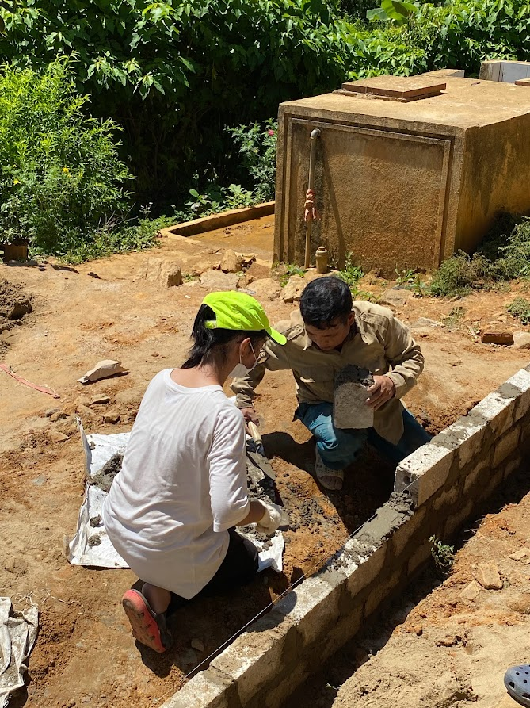

1. Givevalite - Pha Den

The first time I personally arranged each brick, carried each bucket of sand, and mixed the cement was an incredible feeling. Both I and the members of the club were exhausted after a long day wrestling with cement, lime, and carrying loads. But it was a truly joyful and warm feeling to see the new wall built, replacing the old one that was on the verge of collapsing. We visited the teachers and students of Pha Đén Primary School in the middle of June, on a scorching hot day. The school had just over 40 students. When we arrived, we couldn't believe that this was where these children had to walk about 3-4 kilometers every day to get an education. 

In addition to rebuilding the classrooms, we also organized computer classes, English classes, art classes, communications, soft skills, and team-building activities for the children. This was to help them understand more about the world and provide them with valuable information beyond their regular lessons. It was so heartwarming to see the innocent, bright eyes of these children light up with joy and enthusiasm when they participated in these activities. We love these children very much.

2. Givealite - Hang Tau

This is one of the activities in a volunteer event organized by the Givealite Club. We personally prepared essential gifts for over 40 underprivileged families in Hang Tau village, Moc Chau. From groceries, snacks, clothing, and school supplies for the highland children, while the value may not be much, it is extremely precious to the people here. I cannot forget the teary eyes of the ladies and gentlemen when they received their gifts, the bright smiles of the kids when they got candy. This makes me appreciate my own life more because there are still so many difficult situations, struggling for a simple meal every day.

In addition to distributing gifts, we also organized recreational activities for the students in Hang Tau village. This was an opportunity for me to interact with highland children, broaden my horizons, and build new dreams. This volunteer trip has taught me valuable lessons. It has made me understand the importance of sharing and helping those in need. Every gift and every one of our hearts can change someone's life, and that is truly precious.

3. Givelite - Meal Distribution

Every Sunday, the Givealite Club collaborates with “The People I Look After” network to embark on an extraordinary journey to the National Hematology and Blood Transfusion Institute. Our mission is to cook and distribute 150 free meals, including hot soup, to the pediatric patients and elderly patients here.

As soon as I step into the hospital premises, I am immediately impressed by the resilience displayed by each patient in their battle against illness. The young children who are just beginning their lives but are burdened with serious illnesses and the elderly individuals who are nearing the end of their journey all strive to endure their illnesses. 

In addition to providing meals, we also care for and support some of the pediatric patients at the hospital. Spending time with these extraordinary children, who are fighting battles no child should have to face, has given me more motivation, strength, resilience, and optimism in life.

