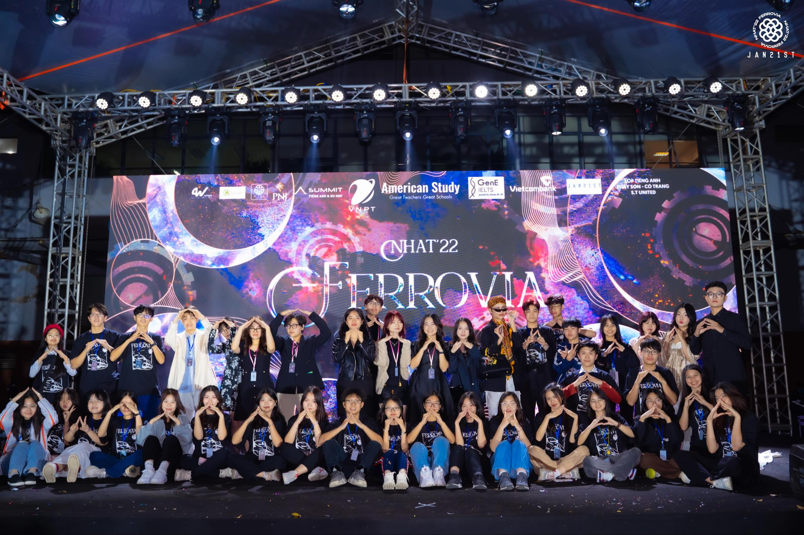

Serving as the Director of Content for Ngay Hoi Anh Tai (NHAT), Hanoi-Amsterdam High School's flagship and largest-scale talent festival, has been an exhilarating journey filled with creativity and leadership. In this role, I had the unique privilege of orchestrating and managing every aspect of this monumental event, from initial content planning to the grand execution. Overseeing a dedicated team of 90+ individuals, we collectively transformed ideas into a spectacular reality.

At NHAT, I was responsible for curating an event that was not just entertaining but also purposeful. I designed program content that was rich in both diversity and impact. Our event comprised a structural chain of activities, each with a unique purpose. For instance, Volunteer Day was a community initiative where we collected and sold recyclable books, ultimately raising 12 million VND for 30 underprivileged households. This act of kindness exemplified the compassionate spirit of our school community.

Sports Day was another highlight of NHAT, a day filled with athletic fervor and camaraderie. We organized four rounds of competitive games, celebrating teamwork and sportsmanship among 13 teams. This day was a testament to the power of unity and friendly competition.

Crowd Dance, a flashmob extravaganza, was yet another feat that I spearheaded. We trained and coordinated over 300 high school freshmen for mesmerizing performances. It was an opportunity to unite students in the joy of dance and creative expression.

The Grand Finale was the grandest of them all, where we showcased the incredible talents within our school community. The event featured Talent Shows and Cultural Camp Contests, bringing together 13 specialized classes and attracting over 5000 annual attendees. Our efforts were not in vain, as we sold over 1000 tickets to Hanoi students and generated a remarkable revenue of 120 million VND.

In the role of Director of Content for NHAT, I found inspiration in the remarkable unity, creativity, and enthusiasm of the Hanoi-Amsterdam High School community. It was an honor to be part of an event that not only celebrated talents but also made a tangible impact on the lives of others, reflecting the values that our school holds dear.

We had so much fun, on top of all!!!

