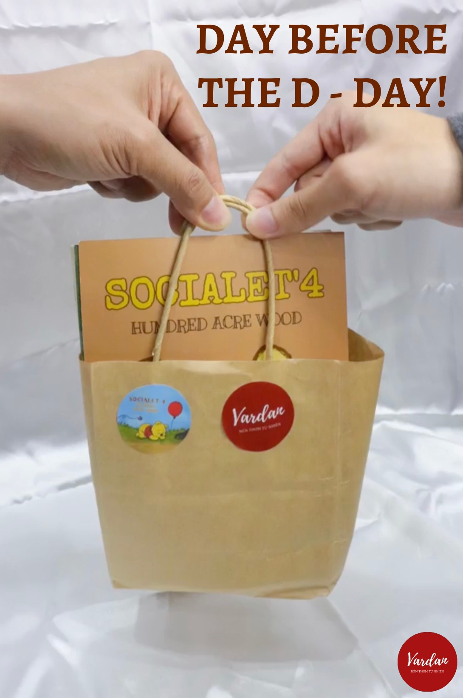

Season 4: Project Manager
As Project Manager, I was in charge of a fantastic team of 10 members, and together, we worked hard to make a difference. My main job was to lead the planning and execution of our mental health projects.

One of the highlights of this season was our student-based social media campaign. We published two articles every week on a fan page with 23,000 followers. Our aim was to educate and engage people in conversations about mental health. It was an awesome experience to see how our articles sparked discussions and made a real impact.

We then designed booklets on healing therapies and a DIY kit for making scented candles. We sold these items and managed to make a profit of 5 million VND. The best part? We used that money to support autistic children at the Hoa Binh childcare center. It felt incredible to know that our work was making a positive change in the world.

Season 5: Senior Project Advisor

In Season 5, I took on a different role as the Senior Project Advisor. This time, I mentored and advised over 10 core team members. My focus was on helping them with operation planning and event management.

It was amazing to see how motivated and driven the team was. My job was to offer guidance and support to make sure everything ran smoothly. It was crucial to ensure that Socialet's initiatives continued to thrive and reach as many high school students as possible.

Being a part of Socialet has been a remarkable journey. I've learned so much and witnessed the power of students coming together to create positive change. My experiences as Project Manager and Advisor have reinforced my belief that together, we can make the world a happier and healthier place. 